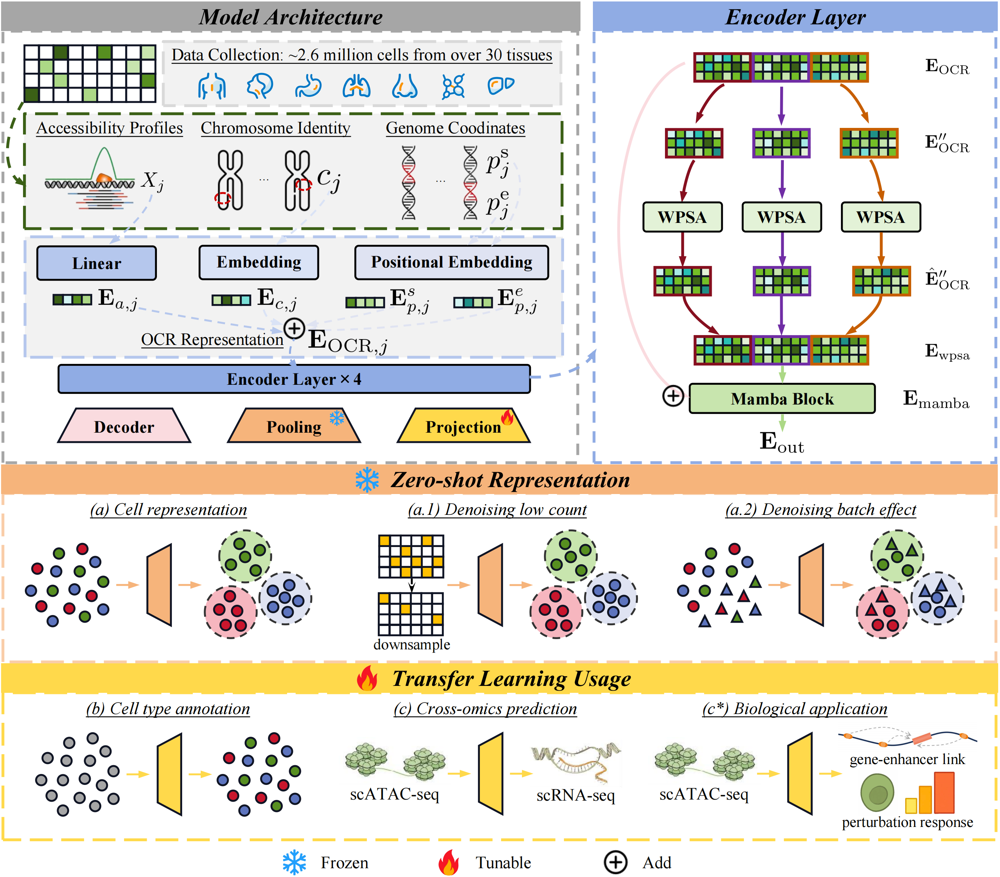

# ChromFound

ChromFound is a foundation model for scATAC-seq that leverages a hybrid architecture and genome-aware tokenization to capture genome-wide regulatory dynamics from chromatin accessibility profiles. Trained on 1.97 million cells spanning 30 tissues and 6 disease contexts, it delivers strong zero-shot and transfer performance across diverse tasks, providing a powerful framework for decoding enhancer–gene regulation and noncoding variant functions. 

ChromFound has been accepted as a poster at NeurIPS 2025. See the preprint: [arXiv:2505.12638](https://arxiv.org/abs/2505.12638). 

## Model Architecture




## Installation Requirements

### System Requirements
- Python 3.10.19
- CUDA Toolkit 12.1.1 (for GPU support)
- CUDA-capable GPU supporting [FlashAttention](https://github.com/Dao-AILab/flash-attention)
- Conda or Miniconda/Mambaforge

### Installation Steps

Please ensure your Conda installation is properly configured and active before running the following commands.

```bash
# First cd into the root of the ChromFound-Parallel folder

# 1) Create and activate the conda environment
conda env create -f environment.yml
conda activate ChromFoundBench

# 2) Install CUDA Toolkit (REQUIRED - must be done explicitly)
# CRITICAL: environment.yml cannot force packages to come from a specific channel.
# You MUST explicitly install CUDA toolkit from the nvidia channel to get GPU support.
# Installing from conda-forge will give you a CPU-only version that won't work with GPUs.
conda install -c nvidia cuda-toolkit=12.1.1

# 3) Install PyTorch (CUDA 12.1 wheels - GPU version)
# CRITICAL: You MUST use the --index-url flag to get the CUDA-enabled version.
# Without it, pip will install the CPU-only version from PyPI which won't work with GPUs.
pip install torch==2.2.2 torchvision==0.17.2 torchaudio==2.2.2 --index-url https://download.pytorch.org/whl/cu121

# 4) Verify GPU installation (IMPORTANT - do not skip this step!)
python -c "import torch; assert torch.cuda.is_available(), 'ERROR: CUDA not available! You may have installed CPU-only versions.'; print(f'✓ CUDA available: {torch.cuda.is_available()}'); print(f'✓ CUDA version: {torch.version.cuda}'); print(f'✓ GPU count: {torch.cuda.device_count()}')"

# 5) Install core dependencies
pip install mamba-ssm==2.2.4 --no-build-isolation
pip install flash-attn==2.5.8 --no-build-isolation

pip install 'scib>=1.1.7'

# 6) Test installs
python test_imports_simple.py
```

**⚠️ CRITICAL: Avoiding CPU-only Installations**

To ensure you get GPU-enabled versions and NOT CPU-only versions:

1. **CUDA Toolkit**: MUST be installed from `-c nvidia` channel. Installing from `conda-forge` will give you a CPU-only version that won't work with GPUs.

2. **PyTorch**: MUST use `--index-url https://download.pytorch.org/whl/cu121`. Without this flag, `pip install torch` will install the CPU-only version from PyPI.

3. **Verification**: Always run the verification command (step 4) after installation. If `torch.cuda.is_available()` returns `False`, you likely have CPU-only versions installed.

**Additional Notes:**
- **NVIDIA Driver compatibility**: Ensure your system NVIDIA driver is compatible with CUDA 12.1+. Check driver requirements: https://docs.nvidia.com/cuda/cuda-toolkit-release-notes/index.html
- **Official documentation**: For detailed CUDA installation instructions, see: https://docs.nvidia.com/cuda/cuda-installation-guide-linux/

For platform-specific notes and troubleshooting when installing Mamba and FlashAttention, see the official installation guides for [mamba-ssm](https://github.com/state-spaces/mamba) and [FlashAttention](https://github.com/Dao-AILab/flash-attention).

### Verified Package Versions

The following versions have been tested and verified to work together:
- Python: 3.10.19
- CUDA Toolkit: 12.1.1 (from nvidia channel)
- PyTorch: 2.2.2+cu121
- torchvision: 0.17.2+cu121
- torchaudio: 2.2.2+cu121
- mamba-ssm: 2.2.4
- flash-attn: 2.5.8
- numpy: 1.26.4
- pandas: 2.3.3
- scipy: 1.15.3
- scikit-learn: 1.7.2
- scanpy: 1.10.4
- episcanpy: 0.3.1
- wandb: 0.23.0


## Quick Start
Note: The GitHub repo does NOT include large assets (`src/checkpoints/` and `sample_data/`). Download them from [Hugging Face](https://huggingface.co/YifengJiao/ChromFound) or [Google Drive](https://drive.google.com/drive/folders/1wSq9gPwnUmSiw3obz1mjyX2ZiXS8sWbf?usp=sharing) and place them locally as follows:
- Pretrained weights: download `model.pt`, `chromfd_pretrain.yaml`, `chromosome_vocab.yaml` into `src/checkpoints/`
- Sample data: download `PBMC169K/*.h5ad` into `sample_data/PBMC169K/`

### Pretrained Weights

Ensure the following files exist in src/checkpoints:
- model.pt (pretrained model weights)
- chromfd_pretrain.yaml (pretrained model config)
- chromosome_vocab.yaml (chromosome index mapping)

Then follow the command in Generate Cell Embeddings (below) by setting:
- `--pretrain_checkpoint_path src/checkpoints`
- `--pretrain_model_file model.pt`
- `--pretrain_config_file chromfd_pretrain.yaml`

### Generate Cell Embeddings
```bash
python -m src/cell_embedding \
    --data_path sample_data/PBMC169K/atac_pbmc_benchmark_VIB_10xv1_1.h5ad \
    --output_path sample_data/PBMC169K/cell_embedding \
    --pretrain_checkpoint_path src/checkpoints \
    --pretrain_model_file model.pt \
    --pretrain_config_file chromfd_pretrain.yaml \
    --batch_size 16 \
    --cell_type_col celltype
```
For an interactive walkthrough and examples, see the tutorial notebook `cell_embedding.ipynb`.

## Data Format

### Input Data Requirements
- **Format**: H5AD (AnnData) format
- **Required Columns**: 
  - `obs`: Cell-level metadata; must include the cell type column used via `--cell_type_col` (e.g., `celltype`).
  - `var`: Feature metadata containing chromosome position information
    - `#Chromosome`: Integer chromosome index as defined in `src/conf/chromosome_vocab.yaml`.
    - `hg38_Start`: 0-based, inclusive genomic start coordinate (int) on the hg38 reference (base pairs).
    - `hg38_End`: 0-based, exclusive genomic end coordinate (int) on the hg38 reference (base pairs).

## Citation
If you use ChromFound, please cite our paper:

```bibtex
@article{jiao2025chromfound,
  title={ChromFound: Towards A Universal Foundation Model for Single-Cell Chromatin Accessibility Data},
  author={Jiao, Yifeng and Liu, Yuchen and Zhang, Yu and Guo, Xin and Wu, Yushuai and Jiang, Chen and Li, Jiyang and Zhang, Hongwei and Han, Limei and Gao, Xin and Qi, yuan and Cheng, yuan},
  journal={arXiv preprint arXiv:2505.12638},
  year={2025}
}
```

## Changelog

### v1.0.0 (2025-10-16)
- Initial release
- Support for basic cell embedding and cell type annotation functionality
- update README.md
