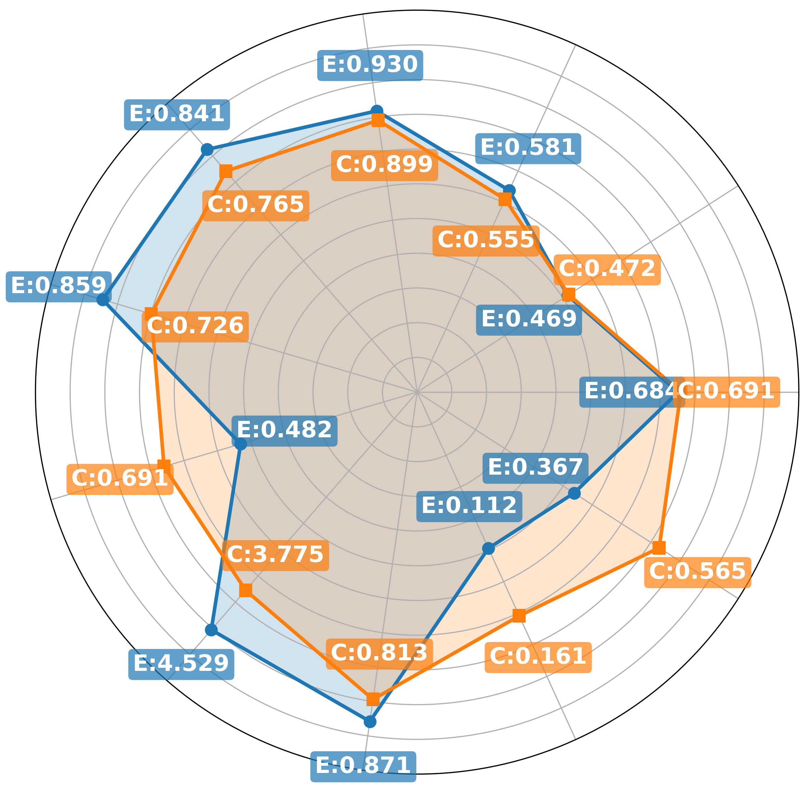

[](https://classroom.github.com/a/jZYLDMog)


# Investigating the Zero-Shot Capabilities of Single-Cell Epigenomic Foundation Models

The practical implementation part of the final project for CS-433 Machine learning course at EPFL. This project focuses on benchmarking two state-of-the-art epigenomic foundation models EpiAgent and ChromFound.

<div align="center">
  
</div>

*The results of this project should be interpreted as research guidelines and must not be used as standalone evidence for clinical decision-making.*

## Repository structure:

- `/benchmarks` - all of our benchmarking code
    - `/benchmarks/epiagent_bench/` - EpiAgent benchmarking scripts
        - `zero_shot_feature_extraction.py` - Zero-shot cell type clustering evaluation with metrics: ARI, NMI, Silhouette, Linear Probe, iLISI, PCR
        - `zero_shot_feature_extraction_shuffling.py` - Shuffling experiments to test model robustness (no shuffling, permuted labels, complete shuffling)
        - `zero_shot_perturbation_effect.py` - Zero-shot perturbation effect prediction using Cohen's D metric
        - `rank-genes-by-chromVAR-order-Pierce_2021.py` - Gene ranking evaluation based on chromVAR order
        - `plot_shuffling.py` - Visualization script for shuffling experiment results
    - `/benchmarks/chromfound_bench/` - ChromFound benchmarking scripts
        - `run_chromfound_pipeline.py` - Main pipeline for ChromFound zero-shot feature extraction (preprocessing, inference, clustering, evaluation)
        - `zero_shot_feature_extraction_chromfound.py` - Zero-shot cell type clustering evaluation with metrics: ARI, NMI, Silhouette, Linear Probe, iLISI, PCR
        - `zero_shot_perturbation_effect_prediction_chromfound.py` - Zero-shot perturbation effect prediction
        - `peaks_order_check.py` - Utility script to verify genomic coordinate ordering of peaks
        - `rank-genes-by-chromVAR-order-Pierce_2021.py` - Gene ranking evaluation based on chromVAR order
    - `/benchmarks/benchmark_utils.py` - Shared utility functions for benchmarks

- `/EpiAgent` - clone of the [EpiAgent repository](https://github.com/xy-chen16/EpiAgent) with the following changes:
    - minor compatibility changes
    - minor performance improvements
    - added two additional preprocessing types in `/EpiAgent/epiagent/preprocessing.py` for the experiments
- `/ChromFound` - clone of the [ChromFound repository](https://github.com/JohnsonKlose/ChromFound/tree/main) with the following changes:
    - minor compatibility improvements
    - minor performance improvements

## Datasets and Required Files

### Datasets

The following datasets need to be downloaded from the [Human-scATAC-Corpus](https://health.tsinghua.edu.cn/human-scatac-corpus/download.php):
- `Kanemaru2023`
- `Li2023b`
- `Buenrostro2018`
- `Pierce2021`
- `Liscovitch-Brauer2021`

The path to each dataset's `*.h5ad` file should be passed to the experiment scripts using `--dataset_path` or `--input_path` (depending on the script).

### EpiAgent Files

EpiAgent experiments require the following files:

1. **Pretrained model weights**: Download from [Google Drive](https://drive.google.com/drive/folders/1WlNykSCNtZGsUp2oG0dw3cDdVKYDR-iX?usp=sharing)
   - Pass the model file path using `--model_path` (or `--pretrained_model_path` for perturbation experiments)

2. **cCRE reference files**: Included in the `EpiAgent` repository
   - `cCRE_document_frequency.npy`: Pass using `--cCRE_document_frequency_path`
   - `cCRE.bed`: Used automatically during preprocessing

### ChromFound Files

ChromFound experiments require pretrained weights downloaded from [Google Drive](https://drive.google.com/drive/folders/1wSq9gPwnUmSiw3obz1mjyX2ZiXS8sWbf):

Place the following files in a checkpoint directory:
- `model.pt`: Model weights file
- `chromfd_pretrain.yaml`: Pretraining configuration file
- `chromosome_vocab.yaml`: Chromosome index mapping file

Pass the checkpoint directory path using:
- `--pretrain_checkpoint_path`: Path to the directory containing the files above
- `--pretrain_model_name`: Name of the model file
- `--pretrain_config_file`: Name of the config file

Note: `chromosome_vocab.yaml` should be in the same directory as `--pretrain_checkpoint_path` and will be loaded automatically.

## Installation

Both EpiAgent and ChromFound require a unique set of dependencies. We advise you to create two separate `conda` environments as shown in the steps below.

We have tested the installation with Python 3.10.19.

### EpiAgent environment preparation

Note: please use the combination of `conda` and `pip` installs as shown below, other combinations are not guaranteed to work.

```bash
# Create the new Conda environment
conda create -n EpiAgentBench python=3.11
conda activate EpiAgentBench

# Install cuda-toolkit using conda (building it gives the incompatible version at least at our machine)
# Note: installing from conda-forge downloads a CPU version
conda install -c nvidia cuda-toolkit=11.7

# Install required additional libraries
pip install torch==2.0.1 torchvision==0.15.2 torchaudio==2.0.2 --index-url https://download.pytorch.org/whl/cu117
pip install torch-geometric torch-scatter torch-sparse -f https://data.pyg.org/whl/torch-2.0.1+cu117.html
conda install faiss

# Install EpiAgent from local folder (will install other packages)
cd EpiAgent
pip install -e .
```

### ChromFound environment preparation

Note: please use the combination of `conda` and `pip` installs as shown below, other combinations are not guaranteed to work.

```bash
cd ChromFound
conda env create -f environment.yml
conda activate ChromFoundBench

# Install cuda-toolkit using conda (building it gives the incompatible version at least at our machine)
# Note: installing from conda-forge downloads a CPU version
conda install -c nvidia cuda-toolkit=12.1.1

pip install torch==2.2.2 torchvision==0.17.2 torchaudio==2.2.2 --index-url https://download.pytorch.org/whl/cu121

# Note: add --no-build-isolation otherwise the packages fail because of version mismatches at buildtime
pip install mamba-ssm==2.2.4 --no-build-isolation
pip install flash-attn==2.5.8 --no-build-isolation

pip install 'scib>=1.1.7'
```

## Running Benchmarks

### EpiAgent Benchmarks

All EpiAgent benchmarks should be run in the `EpiAgentBench` conda environment.

#### Zero-Shot Feature Extraction

Evaluates EpiAgent's ability to extract meaningful cell embeddings for clustering and downstream tasks. Computes metrics including ARI, NMI, Silhouette scores, Linear Probe accuracy, iLISI, and PCR.

```bash
conda activate EpiAgentBench
cd benchmarks/epiagent_bench
python zero_shot_feature_extraction.py \
    --dataset_path /path/to/dataset.h5ad \
    --dataset_name Li2023b \
    --batch_key "Batch (HSC)" \
    --cCRE_document_frequency_path /path/to/cCRE_document_frequency.npy \
    --model_path /path/to/pretrained_EpiAgent.pth \
    --token_cache_dir ./cache
```

#### Zero-Shot Feature Extraction with Shuffling

Tests model robustness by evaluating performance under different shuffling conditions (no shuffling, permuted labels, complete shuffling).

```bash
conda activate EpiAgentBench
cd benchmarks/epiagent_bench
python zero_shot_feature_extraction_shuffling.py \
    --input_path /path/to/dataset.h5ad \
    --cCRE_document_frequency_path /path/to/cCRE_document_frequency.npy \
    --model_path /path/to/pretrained_EpiAgent.pth \
    --embeddings_output_dir /path/to/output/embeddings \
    --device cuda:0 \
    --dataset_name Li2023b \
    --batch_key "Batch (HSC)" \
    --batch_size 15 \
    --num_workers 4
```

#### Zero-Shot Perturbation Effect Prediction

Predicts the effect of genetic perturbations using Cohen's D metric to measure differences between perturbed and control cells.

```bash
conda activate EpiAgentBench
cd benchmarks/epiagent_bench
python zero_shot_perturbation_effect.py \
    --csv_path /path/to/perturbation_data.csv \
    --genes_of_interest sgGATA1 sgMAX sgYY1 \
    --output_dir ./perturbation_outputs \
    --cache_dir /path/to/embeddings/cache \
    --pretrained_model_path /path/to/pretrained_EpiAgent.pth
```

#### Gene Ranking Evaluation

Evaluates gene ranking performance based on chromVAR order from Pierce et al. 2021.

```bash
conda activate EpiAgentBench
cd benchmarks/epiagent_bench
python rank-genes-by-chromVAR-order-Pierce_2021.py
```

### ChromFound Benchmarks

All ChromFound benchmarks should be run in the `ChromFoundBench` conda environment.

#### Zero-Shot Feature Extraction Pipeline

Main pipeline for ChromFound that performs preprocessing, inference, clustering, and evaluation.

```bash
conda activate ChromFoundBench
cd benchmarks/chromfound_bench
python run_chromfound_pipeline.py \
    --dataset_name Liscovitch_Brauer2021 \
    --dataset_path /path/to/dataset.h5ad \
    --project_root /path/to/project/root \
    --results_dir /path/to/results/chromfound/Liscovitch_Brauer2021 \
    --gpu_device 0 \
    --num_cell_merge 1 \
    --batch_size 2 \
    --n_pca_components 50 \
    --n_samples_for_pca 1000 \
    --cell_type_col cell_type \
    --pretrain_checkpoint_path /path/to/checkpoints \
    --pretrain_model_name model.pt \
    --pretrain_config_file chromfd_pretrain.yaml
```

**Note:** Use `--continue_from_step2` flag to skip preprocessing if preprocessed data already exists.

#### Zero-Shot Feature Extraction (Standalone)

Alternative script for ChromFound feature extraction with comprehensive metrics.

```bash
conda activate ChromFoundBench
cd benchmarks/chromfound_bench
python zero_shot_feature_extraction_chromfound.py \
    --dataset_path /path/to/dataset.h5ad \
    --dataset_name Li2023b \
    --batch_key "Batch (HSC)" \
    --root /path/to/data/directory
```

#### Zero-Shot Perturbation Effect Prediction

Predicts perturbation effects using ChromFound embeddings.

```bash
conda activate ChromFoundBench
cd benchmarks/chromfound_bench
python zero_shot_perturbation_effect_prediction_chromfound.py \
    --csv_path /path/to/perturbation_data.csv \
    --genes_of_interest sgGATA1 sgMAX sgYY1 \
    --output_dir ./perturbation_outputs
```

#### Peak Ordering Check

Utility script to verify that peaks in the dataset are properly ordered by genomic coordinates.

```bash
conda activate ChromFoundBench
cd benchmarks/chromfound_bench
python peaks_order_check.py --dataset_path /path/to/dataset.h5ad
```

#### Gene Ranking Evaluation

Evaluates gene ranking performance based on chromVAR order.

```bash
conda activate ChromFoundBench
cd benchmarks/chromfound_bench
python rank-genes-by-chromVAR-order-Pierce_2021.py
```

